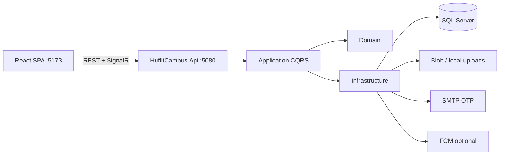

# HUFLIT Campus

Campus digital platform for **HUFLIT** (Ho Chi Minh City University of Foreign Languages – Information Technology).

This repo is the **campus shell** (ASP.NET + React): shared auth, notifications, and modules. It is not “EMS-only”.

| Module | Role |
| --- | --- |
| **EMS** | Events: discover, register, dynamic QR check-in, organizer tools |
| **Ask HUFLIT** | Official Q&A for freshmen/students — answers grounded in a verified knowledge base via **EnterpriseRAG** (citations, abstain when ungrounded). Replaces unverified Facebook-group advice. |

EnterpriseRAG runs as a sidecar AI service (`enterprise-rag` repo). Campus API is the BFF: Entra JWT, rate limits, ACL scope mapping, then proxy to RAG.

## Tech stack

| Layer | Stack |
| --- | --- |
| Backend | ASP.NET Core Clean Architecture, MediatR CQRS, EF Core |
| Target TFM | `net10.0` (csproj) with **EF Core 9** / ASP.NET Core 9 package patterns |
| Database | SQL Server (LocalDB / Docker / Azure SQL) |
| Auth | Microsoft Entra ID (students/lecturers) + Email OTP (guests). **No Google auth.** |
| Realtime | SignalR hub `/hubs/notifications` |
| Storage | Local uploads (dev) or Azure Blob Storage |
| Push | FCM (optional, disabled by default) |
| Frontend | React 19, Vite 6, MUI 6, TanStack Query, Axios, Framer Motion |

> **SDK note:** The solution targets `net10.0` while using EF Core / ASP.NET packages at **9.x**. Architecture and layering follow the ASP.NET Core 9 Clean Architecture style. Build with a compatible .NET SDK that supports the project TFM.

## Solution structure

```text
huflit-campus/
├── docs/                          # Architecture, API, ERD, deployment
├── scripts/
│   ├── dev.ps1 / dev.sh           # Cách 1: dotnet + pnpm
│   ├── docker-up.ps1 / docker-up.sh
│   └── schema.sql
├── package.json                   # pnpm scripts: dev, docker:up, ...
├── docker-compose.yml
├── src/
│   ├── backend/
│   │   ├── HuflitCampus.sln
│   │   ├── HuflitCampus.Api/           # Controllers, hubs, middleware
│   │   ├── HuflitCampus.Application/   # CQRS, DTOs, validators
│   │   ├── HuflitCampus.Domain/        # Entities, enums, repository contracts
│   │   └── HuflitCampus.Infrastructure/# EF Core, auth, storage, SignalR
│   └── frontend/                       # Vite + React SPA
└── README.md
```



## Roles & authentication

| Role | Typical users | Auth |
| --- | --- | --- |
| Guest | External visitors | Email OTP |
| Student / Lecturer | HUFLIT accounts | Microsoft Entra ID |
| ClubManager / FacultyManager | Event organizers | Entra ID |
| Administrator | Platform admins | Entra ID |

**Policies** (see `Policies` / `AuthorizationExtensions`):

- `CanManageEvents` — Lecturer, ClubManager, FacultyManager, Administrator
- `CanApproveEvents` — FacultyManager, Administrator
- `CanViewAnalytics` — FacultyManager, Administrator
- `CanManageUsers` — Administrator

JWT access tokens + refresh tokens for API calls. SignalR accepts `access_token` query string on `/hubs/*`.

## Modules

| Module | Status | Description |
| --- | --- | --- |
| **EMS** | Implemented | Events, registrations, QR attendance, saved events, notifications, calendar, announcements, admin dashboard |
| **Ask HUFLIT** | In progress | Campus Knowledge Assistant — `POST /api/ask/query` BFF → EnterpriseRAG hybrid retrieval + cited answers |
| Food Court | Planned | Future bounded context — do not couple to Auth/Users core |
| Campus Map | Planned | Future bounded context |
| Student Services | Planned | Forms, tickets, appointments (Ask escalate can feed here later) |

See [docs/MODULES.md](docs/MODULES.md) for the module map and how to add a new bounded context.

### Ask HUFLIT + EnterpriseRAG

```text
React SPA (/ask) → HuflitCampus.Api (/api/ask/*) → EnterpriseRAG (/api/v1/retrieval/query)
                         ↑ JWT / ACL scopes              ↑ X-API-Key + hybrid RAG
```

Configure in `appsettings` / env:

| Key | Purpose | Default |
| --- | --- | --- |
| `AskRag:BaseUrl` | EnterpriseRAG base URL | `http://localhost:8000` |
| `AskRag:ApiKey` | Optional `X-API-Key` for RAG | empty |
| `AskRag:TimeoutSeconds` | HttpClient timeout | `60` |
| `AskRag:Enabled` | Feature flag | `true` |

Run EnterpriseRAG separately (`docker compose up` in that repo), seed verified HUFLIT docs, then open **Ask** in the SPA.

## Quick start

Hai cách chạy dự án. Chọn **một** trong hai.

| | Cách 1 — Local | Cách 2 — Docker |
| --- | --- | --- |
| Công cụ | `dotnet` + `pnpm` | Docker Desktop |
| DB mặc định | LocalDB (Windows) | SQL Server container |
| Lệnh nhanh | `pnpm dev` / `.\scripts\dev.ps1` | `pnpm docker:up` / `.\scripts\docker-up.ps1` |
| API | http://localhost:5080 | http://localhost:5080 |
| Web | http://localhost:5173 | http://localhost:5173 |

### Prerequisites

**Cách 1**

- .NET SDK hỗ trợ `net10.0`
- Node.js 20+ và **pnpm** (`npm install -g pnpm`)
- SQL Server LocalDB (Windows) **hoặc** chỉ chạy SQL bằng Docker: `docker compose up sqlserver -d`

**Cách 2**

- Docker Desktop (Compose v2)

---

### Cách 1 — `dotnet` + `pnpm run dev`

Script sẽ: restore/build API → `pnpm install` frontend → chạy API nền → `pnpm`/`vite` dev (proxy `/api`, `/hubs` → `:5080`).

**Windows (PowerShell):**

```powershell
# Lần đầu / mọi lần
.\scripts\dev.ps1

# Đã cài deps rồi
.\scripts\dev.ps1 -SkipInstall

# Hoặc từ root (cần pnpm + pwsh)
pnpm install   # chỉ cần nếu dùng script npm ở root
pnpm dev
```

**macOS / Linux:**

```bash
chmod +x scripts/dev.sh scripts/docker-up.sh
./scripts/dev.sh

# Bỏ qua pnpm install
SKIP_INSTALL=1 ./scripts/dev.sh
```

**Chạy tách terminal (thủ công):**

```bash
# Terminal 1 — API
cd src/backend/HuflitCampus.Api
dotnet restore
dotnet run --launch-profile http

# Terminal 2 — Frontend
cd src/frontend
pnpm install
pnpm run dev
```

- API / Swagger / Health: http://localhost:5080 · `/swagger` · `/health`  
- SPA: http://localhost:5173  
- Dev seed: `DbSeeder` tạo admin + sự kiện mẫu khi DB trống  

LocalDB mặc định trong `appsettings.Development.json`. Nếu dùng SQL Docker:

```bash
docker compose up sqlserver -d
```

rồi chỉnh `ConnectionStrings__DefaultConnection` (xem [Environment config](#environment-config)).

---

### Cách 2 — Docker Compose

Build và chạy SQL + API + frontend:

**Windows:**

```powershell
.\scripts\docker-up.ps1          # foreground + build
.\scripts\docker-up.ps1 -Detach  # nền
.\scripts\docker-up.ps1 -Down    # tắt

# hoặc
pnpm docker:up
pnpm docker:up:d
pnpm docker:down
```

**macOS / Linux:**

```bash
./scripts/docker-up.sh
./scripts/docker-up.sh --detach
./scripts/docker-up.sh down
```

**Tương đương:**

```bash
docker compose up --build
docker compose up --build -d
docker compose down
```

| Service | URL / port |
| --- | --- |
| SQL Server | `localhost:1433` (SA password trong `docker-compose.yml`) |
| API | http://localhost:5080 |
| Frontend (nginx) | http://localhost:5173 |

Nginx trong image frontend proxy `/api` và `/hubs` tới service `api`.  

## Demo seed accounts

Seeded in Development by `DbSeeder` when the DB is empty:

| Email | Role | Notes |
| --- | --- | --- |
| `admin@huflit.edu.vn` | Administrator | Fixed id `11111111-1111-1111-1111-111111111111` |
| `events@huflit.edu.vn` | FacultyManager | Organizer of demo events |

Authenticate with **guest OTP** (SMTP must be configured for real email; otherwise check logs/dev OTP path) or **Microsoft login** using the seeded email after Entra is configured. There is no password login and no Google provider.

Demo events: AI Prompt Engineering Workshop, HUFLIT Career Fair 2026, Inter-Faculty Football Cup.

## Environment config

| Key | Purpose | Example / default |
| --- | --- | --- |
| `ConnectionStrings:DefaultConnection` | SQL Server | LocalDB or Docker SA connection |
| `Jwt:SecretKey` / `Jwt:Key` | JWT signing (≥32 chars) | Change in production |
| `Jwt:Issuer` / `Jwt:Audience` | Token issuer/audience | `HuflitCampus` |
| `Jwt:AccessTokenExpirationMinutes` | Access token lifetime | `60` |
| `Jwt:RefreshTokenExpirationDays` | Refresh lifetime | `14` |
| `AzureAd:*` / `EntraId:*` | Microsoft Entra app | TenantId, ClientId, Audience |
| `BlobStorage:Provider` | `Local` or Azure | `Local` in dev |
| `BlobStorage:ConnectionString` | Azure Blob | Production |
| `BlobStorage:PublicBaseUrl` | Public file base URL | `http://localhost:5080/uploads` |
| `Cors:Origins` | Allowed SPA origins | `http://localhost:5173` |
| `Fcm:Enabled` | Push notifications | `false` |
| `Smtp:*` | Guest OTP email | Host, Port, credentials, FromEmail |
| `AskRag:BaseUrl` | EnterpriseRAG URL for Ask HUFLIT | `http://localhost:8000` |
| `AskRag:ApiKey` | Optional RAG `X-API-Key` | empty in local |
| `AskRag:Enabled` | Toggle Ask BFF | `true` |
| `Seed:DemoAdminEmail` | Documented demo admin | `admin@huflit.edu.vn` |

Prefer environment variables / Azure App Settings in production (`ConnectionStrings__DefaultConnection`, `Jwt__SecretKey`, etc.).

## Documentation

| Doc | Description |
| --- | --- |
| [docs/ARCHITECTURE.md](docs/ARCHITECTURE.md) | Clean Architecture, CQRS, folders |
| [docs/ERD.md](docs/ERD.md) | Entity-relationship diagram |
| [docs/API.md](docs/API.md) | REST + SignalR endpoints |
| [docs/DATABASE.md](docs/DATABASE.md) | Schema, indexes, seeding |
| [docs/DEPLOYMENT.md](docs/DEPLOYMENT.md) | Azure, Entra, FCM, CI/CD, Docker |
| [docs/MODULES.md](docs/MODULES.md) | EMS map + future modules |
| [scripts/schema.sql](scripts/schema.sql) | Full CREATE TABLE script |

## License

Private / institutional project for HUFLIT Campus.
