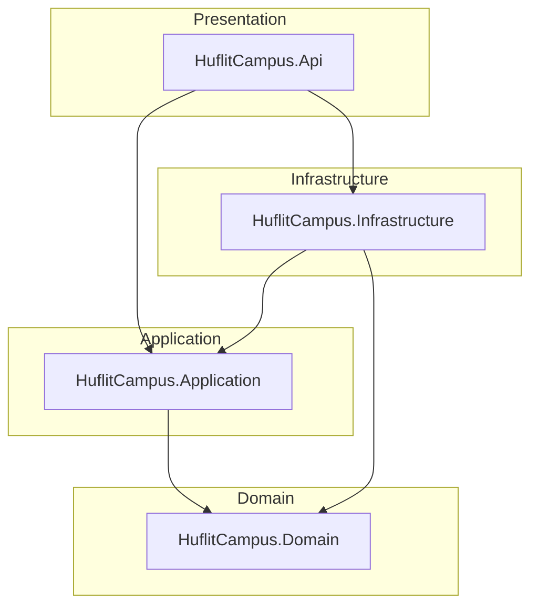

# Architecture

HUFLIT Campus backend follows **Clean Architecture** with **CQRS** (MediatR), repository abstractions, and modular feature folders so future campus modules (Food, Campus Map, etc.) can grow without mutating the Auth/Users core.

## Layers



| Project | Responsibility |
| --- | --- |
| **Domain** | Entities, enums, constants (`Roles`, `Policies`), repository interfaces, `Result` / `PagedResult`, soft-delete/audit base types. No EF, no HTTP. |
| **Application** | CQRS commands/queries, DTOs, FluentValidation-style validators, mappings, application service interfaces. Depends only on Domain. |
| **Infrastructure** | EF Core `ApplicationDbContext`, configurations, repositories, JWT/Entra auth, blob storage, SMTP, SignalR publisher, seeding. |
| **Api** | Controllers, auth policies, Swagger, middleware, health checks, hub mapping. Thin — sends MediatR messages. |

### Dependency rule

Outer layers depend inward. Domain has zero project references. Infrastructure implements Domain/Application interfaces; Api wires DI and HTTP.

## CQRS

- Controllers inject `ISender` (MediatR).
- Features live under `Application/Features/{Area}/Commands|Queries`.
- Commands mutate state; queries read. Both return `Result` / `Result<T>` from Domain.
- Controllers map failures to Problem Details via `ApiControllerBase.FromResult`.

Current feature areas: `Auth`, `Users`, `Events`, `Registrations`, `Attendance`, `SavedEvents`, `Notifications`, `Announcements`, `Dashboard` (calendar queries live under Events).

## Repository & unit of work

- `IRepository<T>`, `IUnitOfWork`, and specialized interfaces (`IEventRepository`, `IUserRepository`, …) in Domain.
- Implementations in `Infrastructure/Persistence/Repositories`.
- Soft delete: repositories set `IsDeleted = true`; global EF query filters exclude deleted rows.

## Auth boundaries (core — do not fork per module)

Keep these stable for all future modules:

- `User`, `RefreshToken`, `OtpChallenge`
- JWT issuance / refresh / logout
- Entra ID Microsoft login + guest Email OTP
- Role claims and shared policies (`CanManageEvents`, etc.)

New modules should **reference** the shared user identity (`UserId`) rather than duplicating auth tables or login flows.

## Modular boundaries (future modules)

Suggested pattern when adding Food Court, Campus Map, etc.:

1. Add Domain entities + enums under a clear namespace (or a separate Domain project if the solution grows large).
2. Add `Application/Features/{NewModule}/…` with its own commands/queries/DTOs.
3. Add Infrastructure EF configurations + repositories; register in DI only.
4. Add Api controllers under `/api/{module}/…`.
5. **Do not** change Auth controllers or User aggregate contracts unless a cross-cutting need is approved.
6. Share notification publishing (`INotificationPublisher`) and blob upload if needed.

See [MODULES.md](MODULES.md) for a step-by-step checklist.

## Folder structure

```text
src/backend/
├── HuflitCampus.sln
├── HuflitCampus.Api/
│   ├── Authorization/          # Policies, Swagger JWT, SignalR token
│   ├── Controllers/            # REST endpoints
│   ├── Middleware/             # Exception handling
│   ├── Properties/launchSettings.json
│   ├── Program.cs
│   └── appsettings*.json
├── HuflitCampus.Application/
│   ├── Common/                 # Interfaces used by Application
│   ├── DTOs/                   # Auth, Events, Registrations, …
│   ├── Features/
│   │   ├── Auth/
│   │   ├── Users/
│   │   ├── Events/
│   │   ├── Registrations/
│   │   ├── Attendance/
│   │   ├── SavedEvents/
│   │   ├── Notifications/
│   │   ├── Announcements/
│   │   └── Dashboard/
│   ├── Mappings/
│   ├── Validators/
│   └── DependencyInjection.cs
├── HuflitCampus.Domain/
│   ├── Common/                 # BaseEntity, Result, ISoftDelete
│   ├── Constants/              # Roles, Policies
│   ├── Entities/
│   ├── Enums/
│   └── Interfaces/Repositories/
└── HuflitCampus.Infrastructure/
    ├── Auth/ / Identity/       # JWT, Entra helpers
    ├── Notifications/          # SignalR hub + publisher, FCM hooks
    ├── Options/
    ├── Persistence/
    │   ├── Configurations/
    │   ├── Repositories/
    │   ├── Seed/DbSeeder.cs
    │   └── ApplicationDbContext.cs
    ├── Storage/                # Local + Azure blob
    └── DependencyInjection.cs

src/frontend/
├── src/
│   ├── api/
│   ├── components/
│   ├── contexts/
│   ├── hooks/
│   ├── pages/
│   ├── routes/
│   ├── theme/
│   └── types/
├── vite.config.ts              # Proxies /api and /hubs → :5080
└── package.json
```

## Cross-cutting concerns

| Concern | Implementation |
| --- | --- |
| Soft delete | `BaseEntity.IsDeleted` + global query filters |
| Audit | `CreatedAt` / `UpdatedAt` / `CreatedBy` / `UpdatedBy` on save |
| CORS | Named policy `Frontend` from `Cors:Origins` |
| Health | `/health` with EF DbContext check |
| Errors | `ExceptionHandlingMiddleware` + Problem Details |
| Files | `POST /api/files/upload` → blob/local under `banner` \| `gallery` |
| Realtime | `NotificationHub` at `/hubs/notifications`, event `notificationReceived` |

## Design principles for EMS

- Event lifecycle is explicit: Draft → PendingApproval → Approved/Rejected → Published → RegistrationClosed → Completed / Cancelled.
- Registration and attendance are separate aggregates linked by FKs.
- Dynamic QR tokens rotate (`QrToken.Sequence`) with optional single-use consumption.
- Counters on `Event` (`ViewCount`, `SaveCount`, `RegistrationCount`) are denormalized for list performance.
