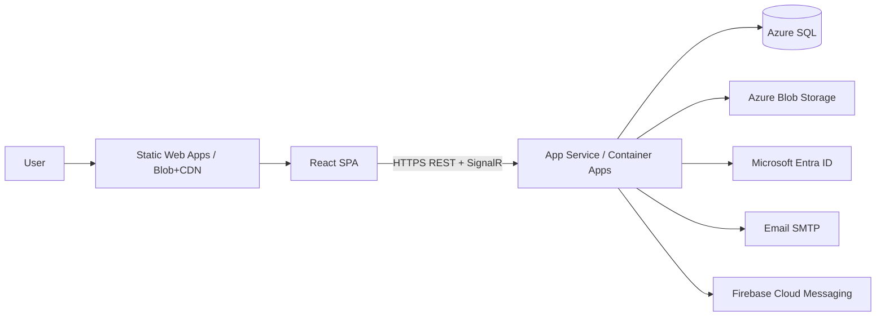

# Deployment

Guide for deploying HUFLIT Campus to Azure with a Docker-friendly local stack.

## Architecture (production)



| Component | Recommended Azure service |
| --- | --- |
| API | Azure App Service (Linux) **or** Azure Container Apps |
| Frontend | Azure Static Web Apps **or** Blob Storage + Azure CDN |
| Database | Azure SQL Database |
| Files | Azure Blob Storage (`huflit-campus` container) |
| Secrets | App Settings / Key Vault references |
| Identity | Microsoft Entra ID app registration |

---

## 1. Azure SQL

1. Create Azure SQL server + database `HuflitCampus`.
2. Allow Azure services; lock down firewall to App Service outbound IPs where possible.
3. Apply schema via EF migrations **or** run [scripts/schema.sql](../scripts/schema.sql).
4. Connection string example:

```text
Server=tcp:<server>.database.windows.net,1433;Initial Catalog=HuflitCampus;User ID=<user>;Password=<pwd>;Encrypt=True;TrustServerCertificate=False;MultipleActiveResultSets=True;
```

Set `ConnectionStrings__DefaultConnection` on the API host. Do **not** run Development `DbSeeder` in production (gated by `IsDevelopment()`).

---

## 2. API — App Service or Container Apps

### Option A: App Service (code or container)

- Runtime: .NET matching project TFM (`net10.0`) or deploy via container (see Dockerfile).
- Enable WebSockets / ARR affinity as needed for SignalR.
- Configure HTTPS only; set CORS origins to the SPA URL.

### Option B: Container Apps

```bash
# Build & push (example)
docker build -f src/backend/Dockerfile -t <acr>.azurecr.io/huflit-campus-api:latest .
az acr login --name <acr>
docker push <acr>.azurecr.io/huflit-campus-api:latest
```

Expose ingress port `8080` (container listens on `ASPNETCORE_URLS=http://+:8080`). Map external HTTPS to the app.

### Required app settings / env vars

| Variable | Notes |
| --- | --- |
| `ASPNETCORE_ENVIRONMENT` | `Production` |
| `ConnectionStrings__DefaultConnection` | Azure SQL |
| `Jwt__SecretKey` / `Jwt__Key` | Strong secret (≥32 chars), store in Key Vault |
| `Jwt__Issuer` / `Jwt__Audience` | Match tokens |
| `EntraId__TenantId` / `AzureAd__TenantId` | Directory ID |
| `EntraId__ClientId` / `AzureAd__ClientId` | App (client) ID |
| `EntraId__Audience` / `AzureAd__Audience` | e.g. `api://<client-id>` |
| `AzureAd__Enabled` | `true` when validating Entra tokens |
| `BlobStorage__Provider` | Azure mode (wire via Infrastructure options) |
| `BlobStorage__ConnectionString` / `AzureBlob__ConnectionString` | Storage account |
| `BlobStorage__ContainerName` | `huflit-campus` |
| `BlobStorage__PublicBaseUrl` | CDN or blob public/base URL |
| `Cors__Origins__0` | `https://your-spa-host` |
| `Smtp__Host`, `Smtp__Port`, `Smtp__Username`, `Smtp__Password`, `Smtp__FromEmail` | Guest OTP |
| `Fcm__Enabled`, `Fcm__ProjectId`, `Fcm__CredentialsPath` / server key | Push (optional) |

---

## 3. Frontend — Static Web Apps or Blob + CDN

### Build

```bash
cd src/frontend
npm ci
npm run build
```

Set production API base URL via build-time env (e.g. `VITE_API_BASE_URL=https://api.example.com`) if the SPA does not rely on same-origin proxy.

### Azure Static Web Apps

- Point app location to `src/frontend`
- Output location: `dist`
- API can remain a separate App Service; configure CORS accordingly.

### Blob + CDN

1. Upload `dist/**` to `$web` or a container.
2. Put CDN in front; configure SPA fallback (`index.html` for 404).
3. Or serve with the frontend Docker image (nginx) on Container Apps / App Service.

---

## 4. Microsoft Entra ID app registration

1. Azure Portal → **Microsoft Entra ID** → **App registrations** → New registration.
2. Supported account types: single tenant (HUFLIT).
3. Add SPA redirect URIs: `http://localhost:5173`, production SPA origin.
4. Expose an API / Application ID URI: `api://<client-id>`.
5. Create a client secret if the API validates tokens server-side with confidential client flows (store as `EntraId__ClientSecret`).
6. Copy **Tenant ID** and **Client ID** into `AzureAd` / `EntraId` settings.
7. Ensure `AzureAd:Domain` is `huflit.edu.vn` (or your tenant domain).
8. Frontend uses MSAL (or equivalent) to obtain an ID token, then calls `POST /api/auth/microsoft-login` with the payload fields expected by `MicrosoftLoginRequest`.

Students and lecturers authenticate via Entra. Guests use Email OTP only — **no Google**.

---

## 5. Azure Blob Storage

1. Create storage account + container `huflit-campus`.
2. Prefer private container + SAS/CDN; for simplest setup use public read on the container or a CDN origin.
3. Set connection string and `PublicBaseUrl` so uploaded URLs work in the SPA.
4. Locally, `BlobStorage:Provider=Local` writes under `wwwroot/uploads`.

---

## 6. FCM (optional)

1. Create a Firebase project; download service account JSON.
2. Set `Fcm:Enabled=true`, `Fcm:ProjectId`, and credentials path/secret mount.
3. Clients register tokens via `PUT /api/users/me/fcm-token`.
4. Keep disabled (`false`) until credentials are available.

---

## 7. CI/CD outline

### Suggested GitHub Actions

1. **Backend job**
   - Restore / build / test `src/backend/HuflitCampus.sln`
   - Build Docker image from `src/backend/Dockerfile`
   - Push to ACR; deploy Container App / App Service revision
2. **Frontend job**
   - `npm ci` + `npm run build` in `src/frontend`
   - Deploy `dist` to Static Web Apps or Blob
3. **Secrets**
   - Azure credentials, SQL connection, JWT secret, Entra IDs, SMTP, storage

Gate production deploys on `main`; use staging slots/apps for preview.

---

## 8. Local Docker Compose

From repository root:

```bash
docker compose up --build
```

| Service | Port | Image / build |
| --- | --- | --- |
| `sqlserver` | 1433 | `mcr.microsoft.com/mssql/server:2022-latest` |
| `api` | 5080 | `src/backend/Dockerfile` |
| `frontend` | 5173 | `src/frontend/Dockerfile` (nginx) |

Default SA password is set in compose for **local only** — change it. Connection string is injected into the API service.

On ARM hosts where SQL Server 2022 is unavailable, swap the image to Azure SQL Edge:

```yaml
image: mcr.microsoft.com/azure-sql-edge
```

---

## 9. Post-deploy checklist

- [ ] `/health` returns healthy
- [ ] Swagger disabled or protected in Production
- [ ] CORS limited to SPA origins
- [ ] JWT secret rotated from repo defaults
- [ ] Entra login works for `@huflit.edu.vn` users
- [ ] Guest OTP email delivers
- [ ] File upload returns reachable URLs
- [ ] SignalR connects with `access_token` query
- [ ] Soft-delete and unique indexes verified against Azure SQL
