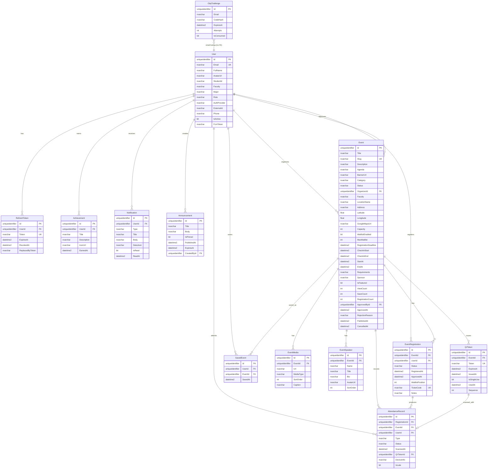

# Entity-relationship diagram

Domain model for HUFLIT Campus EMS. All entities inherit audit/soft-delete fields from `BaseEntity`:

- `Id` (`uniqueidentifier`)
- `CreatedAt`, `UpdatedAt`
- `CreatedBy`, `UpdatedBy`
- `IsDeleted`

Enums are stored as **strings** in SQL (EF `HasConversion<string>()`).

## Mermaid ERD

## Relationship summary

| From | To | Cardinality | Notes |
| --- | --- | --- | --- |
| User | RefreshToken | 1:N | Cascade delete |
| User | Achievement | 1:N | Cascade delete |
| User | Notification | 1:N | Cascade delete |
| User | SavedEvent | 1:N | Cascade delete |
| User | EventRegistration | 1:N | Restrict delete |
| User | Event (Organizer) | 1:N | Restrict |
| User | Event (ApprovedBy) | 1:N optional | Restrict |
| User | Announcement | 1:N | Restrict (`CreatedById`) |
| Event | EventMedia / EventSpeaker | 1:N | Cascade |
| Event | EventRegistration / QrToken / SavedEvent | 1:N | Cascade |
| EventRegistration | AttendanceRecord | 1:N | Cascade |
| AttendanceRecord | QrToken | N:0..1 | SetNull on QR delete |
| OtpChallenge | — | — | Keyed by email; no FK to User |

## Enum values (reference)

| Enum | Values |
| --- | --- |
| `UserRole` | Guest, Student, Lecturer, ClubManager, FacultyManager, Administrator |
| `AuthProvider` | MicrosoftEntra, EmailOtp |
| `EventCategory` | Academic, Workshop, Competition, Volunteer, Seminar, Career, Sports, Arts, Entertainment, ClubActivities |
| `EventStatus` | Draft, PendingApproval, Approved, Rejected, Published, Cancelled, RegistrationClosed, Completed |
| `RegistrationStatus` | Pending, Approved, Rejected, Waitlisted, Cancelled, Attended, NoShow |
| `AttendanceType` | CheckIn, CheckOut |
| `AttendanceStatus` | OnTime, Late, EarlyLeave, Valid |
| `NotificationType` | RegistrationApproved, RegistrationRejected, EventReminder, EventUpdated, RegistrationClosed, NewEvent, AttendanceConfirmed |
| `MediaType` | Image, Video |

## Unique constraints (logical)

- `Users.Email` unique where not deleted
- `Events.Slug` unique where not deleted
- `EventRegistrations (EventId, UserId)` unique where not deleted
- `SavedEvents (UserId, EventId)` unique where not deleted
- `RefreshTokens.Token`, `QrTokens.Token`, `EventRegistrations.TicketCode` unique

See [DATABASE.md](DATABASE.md) and [scripts/schema.sql](../scripts/schema.sql) for physical indexes.
