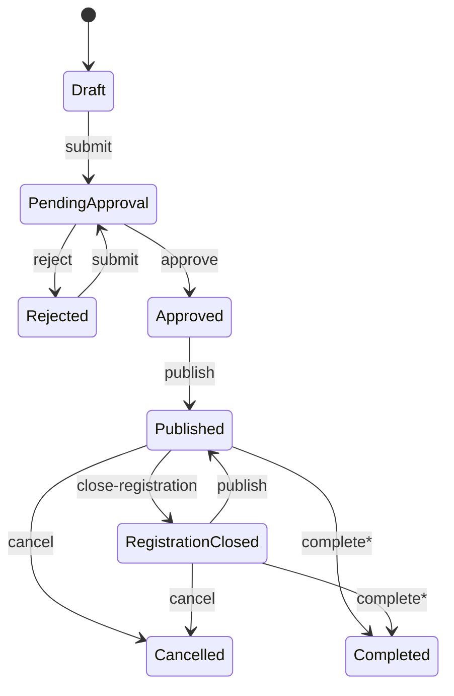

# Modules

## EMS (Event Management System) — current

EMS is the first HUFLIT Campus module. It owns event lifecycle, registration, QR attendance, bookmarks, notifications related to events, calendar views, announcements (read API), and admin analytics.

### Feature map

| Area | Application folder | API | Domain entities |
| --- | --- | --- | --- |
| Auth (shared core) | `Features/Auth` | `/api/auth` | User, RefreshToken, OtpChallenge |
| Users (shared core) | `Features/Users` | `/api/users` | User, Achievement (entity only) |
| Events | `Features/Events` | `/api/events`, `/api/calendar` | Event, EventMedia, EventSpeaker |
| Registrations | `Features/Registrations` | `/api/registrations` | EventRegistration |
| Attendance | `Features/Attendance` | `/api/attendance` | AttendanceRecord, QrToken |
| Saved events | `Features/SavedEvents` | `/api/saved-events` | SavedEvent |
| Notifications | `Features/Notifications` | `/api/notifications` + SignalR | Notification |
| Announcements | `Features/Announcements` | `/api/announcements` | Announcement |
| Dashboard | `Features/Dashboard` | `/api/dashboard` | Aggregates over EMS tables |
| Files (shared) | — | `/api/files` | Blob storage |

### EMS workflows



\*Completion is domain-supported (`MarkCompleted`); no dedicated controller action is exposed yet.

Registration: Pending → Approved / Rejected / Waitlisted → Attended / NoShow / Cancelled.

---

## Ask HUFLIT (Campus Knowledge Assistant) — in progress

Official Q&A for students/freshmen. Answers come only from a **verified** knowledge base (EnterpriseRAG), with citations. Not UGC and not Facebook-group gossip.

| Area | Ownership |
| --- | --- |
| BFF | `Features/Ask`, `IAskRagClient`, `/api/ask` |
| AI engine | External **EnterpriseRAG** (FastAPI) — hybrid retrieve, citation verify, hallucination shield |
| UI | SPA route `/ask` + admin LLM routing panel |
| Auth | Reuse campus JWT; map role → RAG `X-ACL-Scope` (`public`, `student`, admin `*`-equivalent via RAG key) |
| **KB CRUD (Administrator)** | **Planned / required:** Admin uploads, updates, deletes, and reindexes verified campus documents via campus BFF → EnterpriseRAG ingest (`/api/v1/ingestion/*`). Students never write the official corpus. |

### Ask workflows

```text
Student asks → Campus BFF (auth + rate limit + ACL) → EnterpriseRAG
                    ↓
              answer + sources  OR  abstain (“không đủ căn cứ”)
                    ↓
         (later) escalate ticket → Student Services

Administrator → CRUD knowledge docs (upload / version / retire) → reindex → Ask answers update
```

**Do not** index Life@HUFLIT / social UGC as “official” corpus. Keep community content clearly labeled if deep-linked later.

---

## Planned modules (future)

| Module | Suggested route prefix | Suggested ownership |
| --- | --- | --- |
| Food Court | `/api/food/…` | Menus, vendors, orders — **not** Auth |
| Campus Map | `/api/map/…` | Buildings, POIs, indoor routing |
| Student Services | `/api/services/…` | Forms, tickets, appointments |

These must treat **Auth/Users as a shared kernel**:

- Use existing `User.Id` as FK / claim subject.
- Reuse JWT policies or add **module-specific policies** without changing login providers.
- Publish notifications through `INotificationPublisher` / SignalR.
- Upload media via `/api/files` or a module-scoped storage folder convention.

**Do not** add Google OAuth, duplicate user tables, or fork refresh-token logic per module.

---

## How to add a new bounded context

1. **Domain**  
   - Add entities under `Domain/Entities` (or a dedicated project later).  
   - Add enums/constants as needed.  
   - Add repository interfaces under `Domain/Interfaces/Repositories`.  
   - Reference `User` only by `Guid UserId` FK — do not embed auth logic.

2. **Application**  
   - Create `Features/{ModuleName}/Commands` and `Queries`.  
   - Add DTOs under `DTOs/{ModuleName}`.  
   - Register handlers via existing MediatR assembly scan in `AddApplication()`.

3. **Infrastructure**  
   - Add `IEntityTypeConfiguration<>` classes.  
   - Implement repositories; expose on `IUnitOfWork` if needed.  
   - Register services in `DependencyInjection.cs`.  
   - Avoid changing `DbSeeder` auth users unless required for demos.

4. **Api**  
   - Add `Controllers/{ModuleName}Controller.cs` with route `api/{module}`.  
   - Apply `[Authorize]` / new policies in `AuthorizationExtensions` if needed.  
   - Update Swagger description.

5. **Frontend**  
   - Add pages/routes/api clients under `src/frontend/src` without touching the shared auth context contracts.

6. **Docs**  
   - Update this file, [ERD.md](ERD.md), [API.md](API.md), and `scripts/schema.sql`.

### Checklist

- [ ] No changes to Entra/OTP login flows unless cross-cutting
- [ ] No new identity provider (especially no Google)
- [ ] Soft delete + audit columns on new entities
- [ ] Indexes for hot filters / unique business keys
- [ ] Authorization policies documented
- [ ] Migrations or `schema.sql` updated
